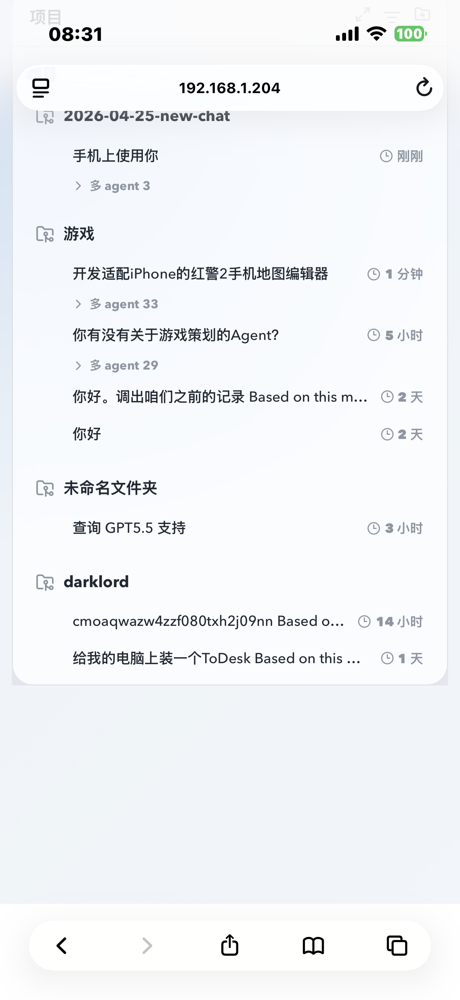
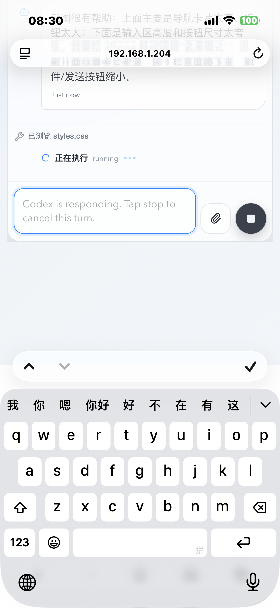
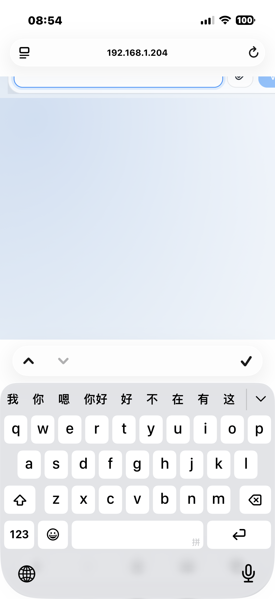

<div align="center">

# CODEX WORKBENCH

一个面向 Codex Desktop 的本地优先手机远程工作台。

[](https://nodejs.org/)
[](https://react.dev/)
[](https://vitejs.dev/)
[](#许可证)

语言 / Language: [中文](#中文) | [English](#english)

</div>

## 中文

CODEX WORKBENCH 是一个运行在你自己电脑上的 Codex 远程工作台。它通过本机 Host Service 读取 Codex Desktop 的项目、线程、聊天记录和工具执行状态，再把这些内容同步到手机端 PWA，让你在手机上继续操作 Codex。

这个项目的目标不是远程桌面镜像，而是做一个更轻、更适合手机的 Codex 操作入口：项目列表、对话线程、消息历史、工具记录、附件上传、发送/停止/重试、模型选择、实时状态同步，都尽量按照手机体验重新组织。

> iOS 原生 App 正在开发中。当前主力可用版本是 Web/PWA + 本机 Host Service。

### 目录

- [功能特性](#功能特性)
- [运行截图](#运行截图)
- [项目架构](#项目架构)
- [快速开始](#快速开始)
- [手机访问](#手机访问)
- [常用命令](#常用命令)
- [HTTP API](#http-api)
- [WebSocket 事件](#websocket-事件)
- [安全说明](#安全说明)
- [路线图](#路线图)
- [许可证](#许可证)

### 功能特性

- 手机端查看 Codex Desktop 的项目与对话线程。
- 打开任意线程并查看完整聊天历史。
- 实时同步桌面端新增消息、工具调用和运行状态。
- 在手机端继续发送消息到同一个桌面线程。
- 支持停止当前任务、重试最近一次输入。
- 支持附件上传，包括图片、文本、CSV、JSON、PDF 等。
- 支持 `/` 命令和 `@` 引用输入助手。
- 支持模型选择入口，并为后续和桌面端模型状态同步预留接口。
- 支持固定密码登录、短期 access token、长期 refresh token。
- 支持首次打开时设置密码，以及后续在设置中修改密码。
- 支持 iPhone Safari/PWA 的移动端布局优化，包括键盘弹起、输入框、上下滚动和横向拖动限制。
- 正在开发 SwiftUI 原生 iOS 客户端，用于未来 App Store 发布。

### 运行截图

| 项目与对话列表 | 聊天输入与运行状态 | 手机输入体验 |
| --- | --- | --- |
|  |  |  |

### 项目架构

```text
CODEX WORKBENCH
├── src/server          # 本机 Host Service
├── src/client          # 手机端 PWA
├── public              # PWA manifest 与图标资源
├── ios/CodexWorkbench  # 开发中的 SwiftUI 原生 iOS 客户端
└── docs/screenshots    # README 截图资源
```

核心设计：

- 读取 Codex 本机状态时，以本地 Codex 会话文件为唯一真相源。
- 写入消息时，不直接修改 Codex 数据库或 JSONL，而是走 Codex CLI/桥接命令层。
- 手机端通过 HTTP API 获取项目、线程、消息和系统状态。
- 手机端通过 WebSocket 接收实时更新。
- 首版建议只在可信局域网或 VPN 内使用，不建议直接暴露公网。

### 快速开始

安装依赖：

```bash
npm install
```

准备环境变量：

```bash
cp .env.example .env
```

启动服务：

```bash
npm start
```

默认地址：

```text
http://127.0.0.1:8787/
```

### 手机访问

如果要在手机上访问，需要让服务监听局域网地址：

```bash
CODEX_REMOTE_HOST=0.0.0.0 \
CODEX_REMOTE_PORT=8787 \
CODEX_REMOTE_PASSWORD=change-this-password \
npm start
```

然后在手机浏览器中打开：

```text
http://<你的 Mac 局域网 IP>:8787/
```

例如：

```text
http://192.168.1.204:8787/
```

### 常用命令

```bash
npm test
npm run build
npm start
```

### HTTP API

当前 Host Service 暴露的主要接口：

- `POST /api/auth/login`：密码登录。
- `GET /api/auth/status`：查询是否需要首次设置密码。
- `POST /api/auth/setup`：首次设置访问密码。
- `POST /api/auth/password`：修改访问密码。
- `GET /api/projects`：获取项目列表与最近线程。
- `GET /api/threads?project=<cwd>`：获取项目下线程。
- `GET /api/threads/:threadId`：获取线程详情。
- `GET /api/threads/:threadId/messages`：获取线程消息与工具事件。
- `POST /api/threads/:threadId/send`：继续向线程发送消息。
- `POST /api/threads/:threadId/cancel`：停止当前运行。
- `POST /api/threads/:threadId/retry`：重试最近输入。
- `GET /api/system/status`：获取主机与 Codex CLI 状态。

### WebSocket 事件

WebSocket 入口：

```text
/ws
```

主要事件：

- `project.updated`
- `thread.updated`
- `thread.status`
- `message.appended`
- `run.started`
- `run.finished`
- `run.failed`

### 安全说明

- 不建议将 Host Service 直接暴露到公网。
- 首版推荐在可信局域网、Tailscale、ZeroTier 或其他 VPN 环境中使用。
- 请不要提交真实 `.env`、本机 Codex 状态、访问 token、上传文件或个人密钥。
- 固定密码适合单用户本机使用；如果要多人或公网访问，需要升级为更完整的认证方案。

### 路线图

- [x] 手机端项目/线程列表。
- [x] 完整消息历史解析。
- [x] WebSocket 实时同步。
- [x] 手机端继续发送消息。
- [x] 停止/重试当前任务。
- [x] 附件上传。
- [x] `/` 命令与 `@` 引用输入助手。
- [x] 首次设置密码与修改密码。
- [x] 移动端 PWA 布局优化。
- [ ] 更完整的工具执行状态展示。
- [ ] 更稳定的桌面端状态同步。
- [ ] 原生 SwiftUI iOS App。
- [ ] App Store 发布准备。

### 许可证

许可证尚未确定。公开发布和第三方使用前建议补充明确的开源许可证。

## English

CODEX WORKBENCH is a local-first mobile workbench for Codex Desktop. It runs on your own computer, reads local Codex Desktop state through a host service, and exposes a mobile PWA for viewing projects, opening threads, reading message history, sending follow-up messages, uploading attachments, and tracking tool/run status.

The project is not a remote desktop mirror. It is a mobile-first control surface for Codex Desktop.

> A native SwiftUI iOS app is under development. The current usable version is the Web/PWA plus local Host Service.

### Features

- Browse Codex Desktop projects and conversation threads from a phone.
- Open any thread and view full chat history.
- Sync desktop messages, tool calls, and run status in real time.
- Continue sending messages to the same desktop thread.
- Stop active runs and retry the latest input.
- Upload attachments such as images, text, CSV, JSON, and PDF files.
- Use `/` commands and `@` reference suggestions in the composer.
- Configure model selection entry points.
- Use password login with access/refresh tokens.
- Set the first-run password and change it later from settings.
- Mobile Safari/PWA layout optimizations for keyboard, scrolling, and touch behavior.
- Native SwiftUI iOS client under development.

### Screenshots

| Projects and Threads | Chat and Run Status | Mobile Composer |
| --- | --- | --- |
|  |  |  |

### Quick Start

```bash
npm install
cp .env.example .env
npm start
```

Open:

```text
http://127.0.0.1:8787/
```

For mobile LAN access:

```bash
CODEX_REMOTE_HOST=0.0.0.0 \
CODEX_REMOTE_PORT=8787 \
CODEX_REMOTE_PASSWORD=change-this-password \
npm start
```

Then open:

```text
http://<your-mac-lan-ip>:8787/
```

### Development

```bash
npm test
npm run build
npm start
```

### Security

- Do not expose the host service directly to the public internet.
- Use a trusted LAN or VPN for early versions.
- Keep real `.env` files, local Codex state, access tokens, uploaded files, and private keys out of Git.
